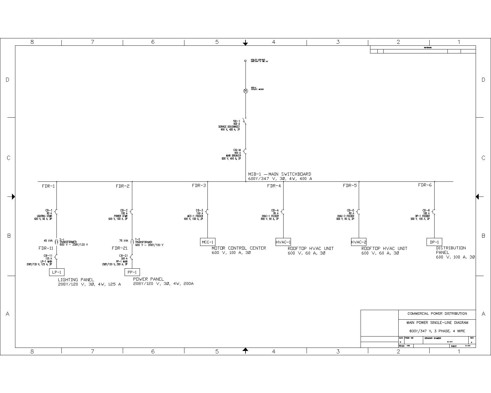
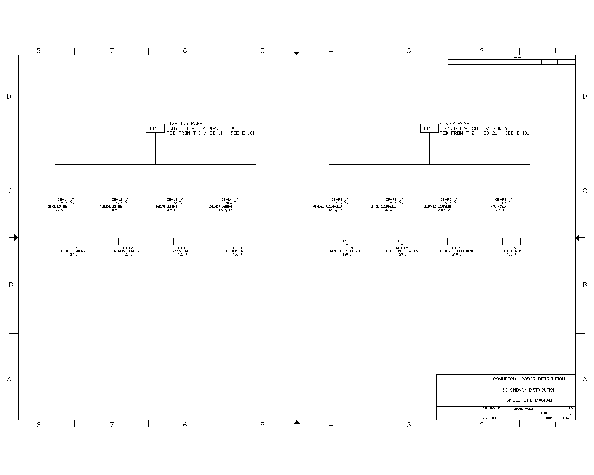
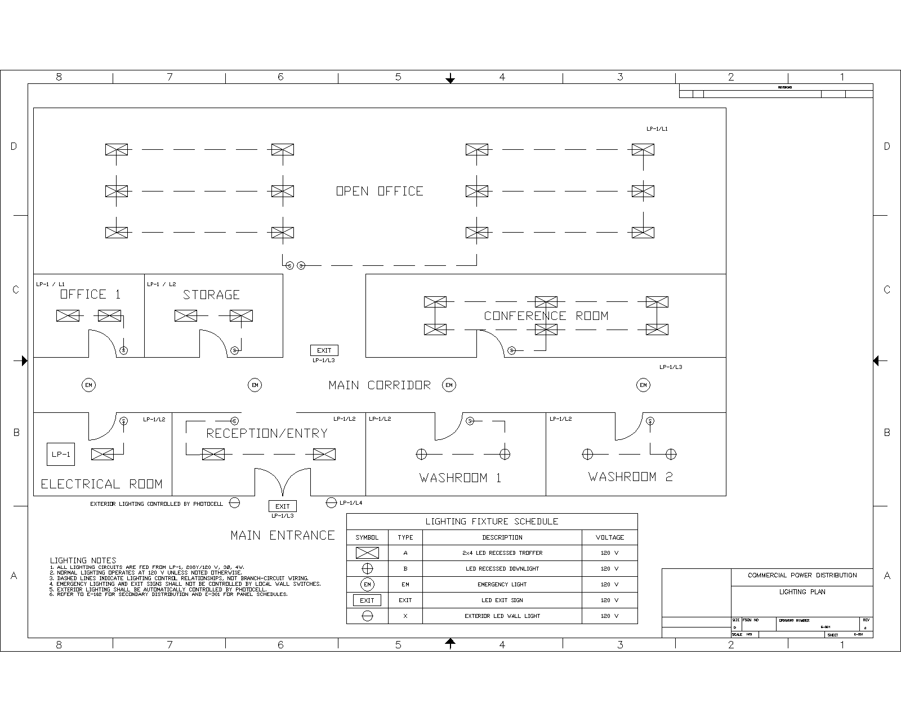
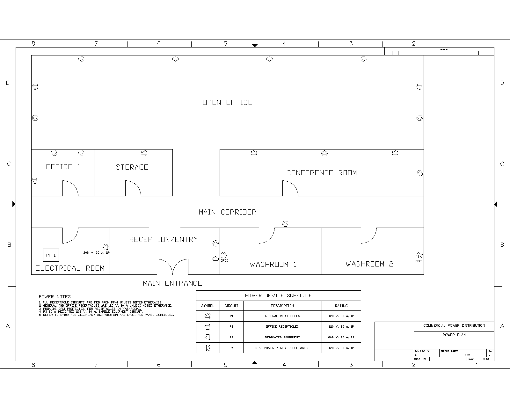
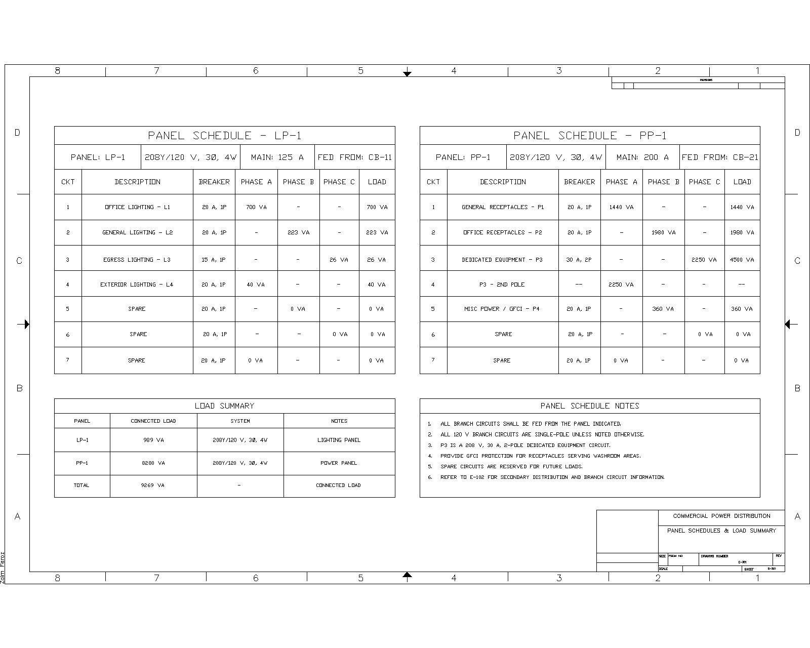
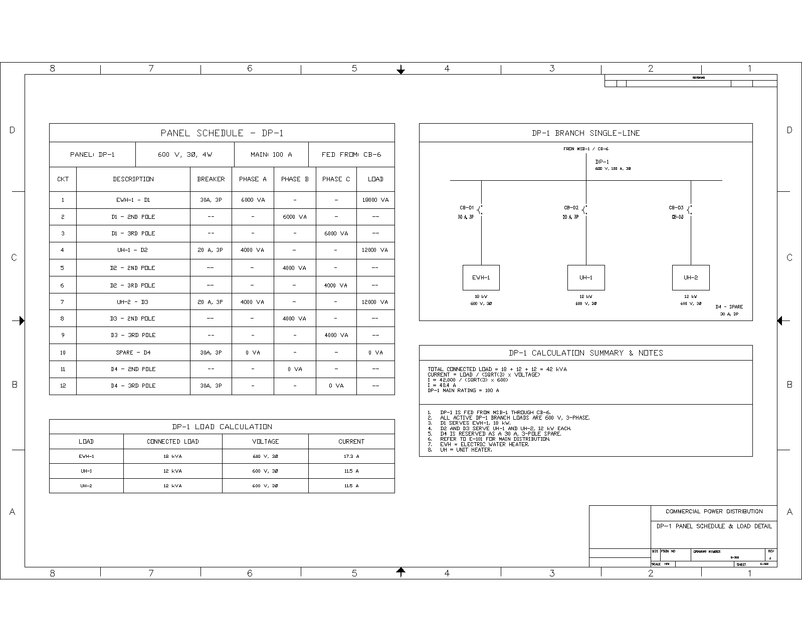
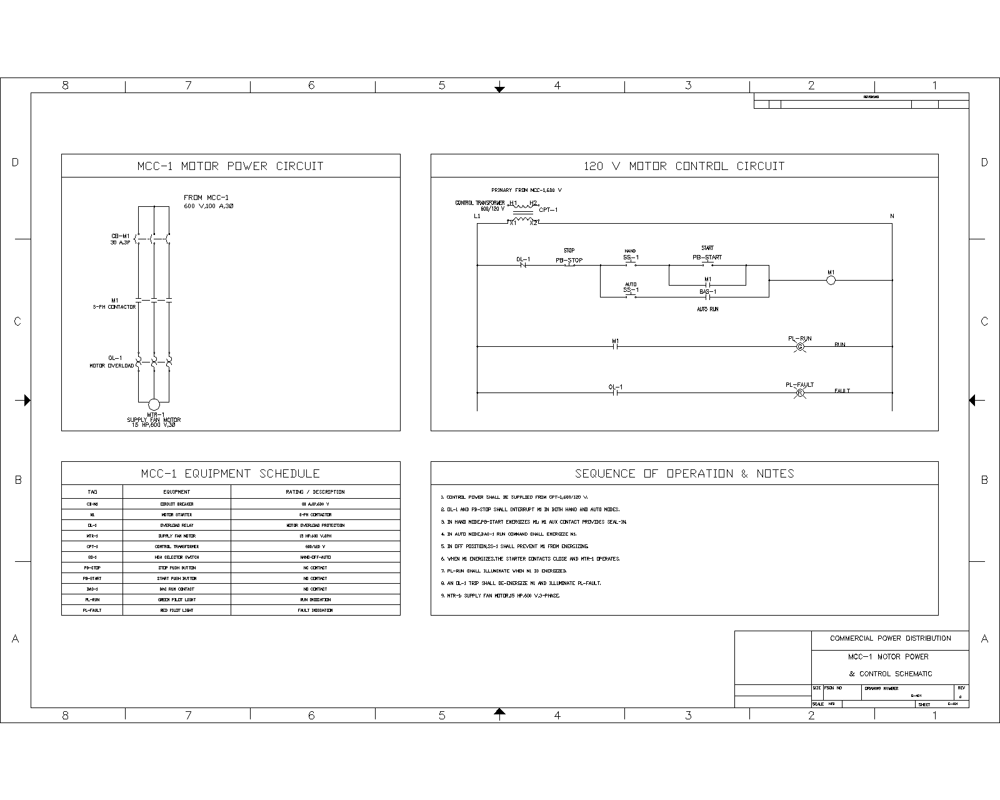
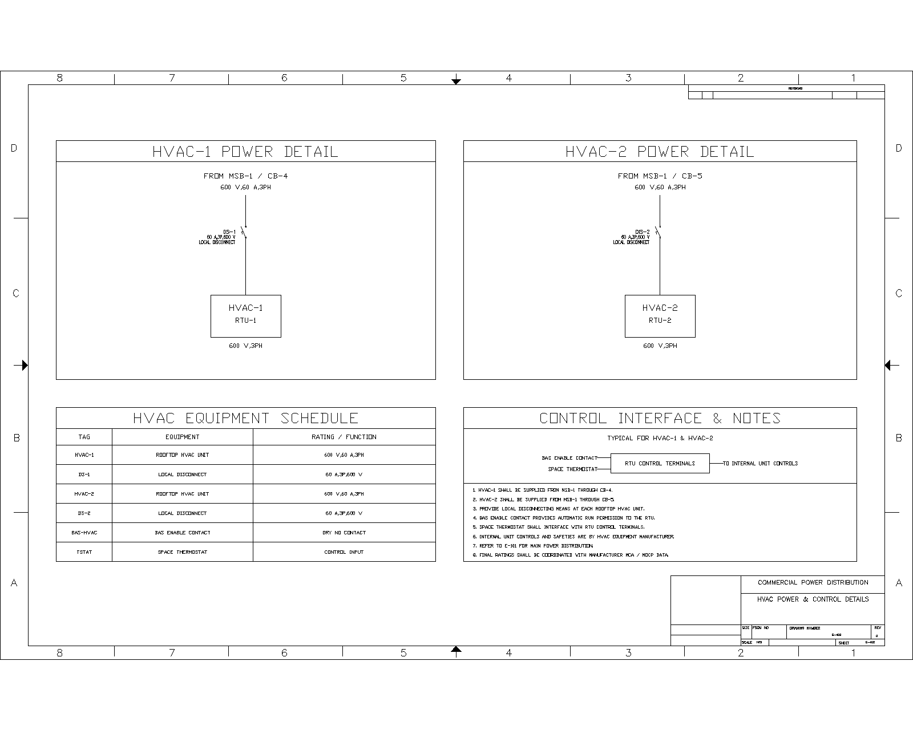

# Commercial Office Electrical Distribution & Controls Design

  

An end-to-end commercial electrical design project covering power distribution, single-line diagrams, lighting and receptacle layouts, panel schedules, three-phase load calculations, motor control, and HVAC power and control interfaces.

## Overview

Designed and developed a complete electrical distribution and controls drawing package for a single-storey commercial office building using AutoCAD Electrical.

The project develops the electrical system from a 600Y/347 V main service through 208Y/120 V secondary distribution, lighting and receptacle panels, mechanical loads, motor control, and rooftop HVAC equipment.

The completed project consists of eight coordinated electrical drawings supported by a separate Electrical Calculations & Design Basis document.

## Project Documents

- [Complete 8-Sheet Electrical Drawing Set](Documents/Commercial%20Office%20Electrical%20Drawing%20Set.pdf)
- [Electrical Calculations & Design Basis](Documents/COMMERCIAL%20OFFICE%20CALCULATIONS.pdf)

## Features

- 600Y/347 V, 3-phase, 4-wire main electrical distribution
- 208Y/120 V secondary distribution
- Main switchboard and feeder coordination
- Transformer-fed lighting and power panels
- Commercial lighting layout
- Receptacle and dedicated equipment power layout
- LP-1, PP-1, and DP-1 panel schedules
- Three-phase load calculations
- 600 V motor power and control design
- HAND/AUTO motor control
- BAS motor enable interface
- Rooftop HVAC power distribution
- HVAC BAS and thermostat control interfaces
- Representative feeder voltage-drop analysis
- Eight-sheet coordinated AutoCAD Electrical drawing package

## Software & Tools

- AutoCAD Electrical
- Microsoft Excel
- Microsoft Word
- Electrical single-line diagram development
- Panel scheduling
- Three-phase power calculations
- Electrical load analysis
- Motor control design
- HVAC electrical coordination

## System Architecture

The building electrical system is supplied from a 600Y/347 V, three-phase, four-wire main distribution system through MSB-1.

MSB-1 distributes power through six major feeders:

| Feeder | Equipment | Function |
|---|---|---|
| FDR-1 | T-1 / LP-1 | Lighting distribution |
| FDR-2 | T-2 / PP-1 | Receptacle and equipment power |
| FDR-3 | MCC-1 | Motor control |
| FDR-4 | HVAC-1 | Rooftop HVAC unit |
| FDR-5 | HVAC-2 | Rooftop HVAC unit |
| FDR-6 | DP-1 | Mechanical heating loads |

T-1 and T-2 step the 600 V distribution system down to 208Y/120 V for the building lighting and receptacle systems.

---

## Main Power Distribution

  

### E-101 — Main Power Single-Line Diagram

- Developed the main 600Y/347 V building distribution architecture.
- Designed MSB-1 as the central distribution point for the building.
- Coordinated six outgoing feeders serving transformers, motor control, HVAC equipment, and DP-1.
- Developed transformer-fed 208Y/120 V secondary distribution.
- Coordinated breaker, feeder, and equipment identification across the drawing package.

---

## Secondary Distribution

  

### E-102 — Secondary Distribution Single-Line Diagram

The secondary distribution system consists of LP-1 and PP-1 operating at 208Y/120 V, three-phase, four-wire.

### LP-1

- 125 A panel
- Supplies building lighting circuits
- Fed from T-1 through CB-11

### PP-1

- 200 A panel
- Supplies receptacles and dedicated equipment
- Fed from T-2 through CB-21

---

## Lighting Design

  

### E-201 — Lighting Plan

Developed the lighting layout for the single-storey commercial office, including:

- Office and general-area lighting
- Conference and reception lighting
- Storage and electrical-room lighting
- Washroom lighting
- Egress and exterior lighting
- Lighting switches
- Fixture identification
- LP-1 circuit assignments

| Circuit | Description |
|---|---|
| L1 | Office Lighting |
| L2 | General Lighting |
| L3 | Egress Lighting |
| L4 | Exterior Lighting |

---

## Power Design

  

### E-202 — Power Plan

Developed the building receptacle and equipment power layout, including general receptacles, office receptacles, washroom GFCI devices, dedicated equipment power, and PP-1 circuit assignments.

| Circuit | Description | Connected Load |
|---|---|---:|
| P1 | General Receptacles | 1,440 VA |
| P2 | Office Receptacles | 1,980 VA |
| P3 | Dedicated Equipment | 4,500 VA |
| P4 | Miscellaneous / GFCI | 360 VA |

**Total PP-1 Connected Load: 8.28 kVA**

---

## Panel Schedules

  

### E-301 — LP-1 & PP-1 Panel Schedules

Developed coordinated panel schedules for the building lighting and receptacle distribution systems.

| Panel | Voltage | Main Rating | Modeled Connected Load |
|---|---|---:|---:|
| LP-1 | 208Y/120 V, 3Ø, 4W | 125 A | 989 VA |
| PP-1 | 208Y/120 V, 3Ø, 4W | 200 A | 8.28 kVA |

The schedules coordinate circuit numbers, connected loads, breaker arrangements, and downstream equipment with the lighting and power plans.

---

## DP-1 Distribution

  

### E-302 — DP-1 Panel Schedule & Load Detail

DP-1 is a 600 V, three-phase distribution panel supplying building mechanical heating equipment.

| Equipment | Description | Load |
|---|---|---:|
| EWH-1 | Electric Water Heater | 18 kW |
| UH-1 | Unit Heater | 12 kW |
| UH-2 | Unit Heater | 12 kW |
| **Total** | | **42 kW** |

For balanced three-phase resistive loading:

**I = P / (√3 × VLL × PF)**

Using:

- P = 42,000 W
- VLL = 600 V
- PF = 1.0

**Calculated DP-1 connected-load current: 40.4 A**

DP-1 is shown with a 100 A main rating, providing capacity above the presently modeled connected load.

---

## Motor Power & Control

  

### E-401 — MCC-1 Motor Power & Control

Designed the power and control system for MTR-1, a 15 hp, 600 V, three-phase supply fan motor.

### Motor Power Circuit

- CB-M1 branch protection
- M1 motor starter / contactor
- OL-1 overload relay
- MTR-1 15 hp supply fan motor
- CPT-1 600/120 V control transformer

### Motor Control

Developed a 120 V control circuit incorporating:

- HAND/AUTO selector control
- STOP and START pushbuttons
- Contactor seal-in contact
- BAS automatic enable
- Overload protection
- RUN indication
- FAULT indication

The estimated motor operating current was calculated using an assumed power factor of 0.85 and efficiency of 90%.

**Estimated MTR-1 Operating Current: 14.1 A**

---

## HVAC Power & Control

  

### E-402 — HVAC Power & Control

Developed electrical power and control interfaces for two packaged rooftop HVAC units.

| Equipment | Source | Supply | Branch | Disconnect |
|---|---|---|---|---|
| HVAC-1 | MSB-1 / CB-4 | 600 V, 3Ø | 60 A, 3P | DS-1 |
| HVAC-2 | MSB-1 / CB-5 | 600 V, 3Ø | 60 A, 3P | DS-2 |

The control interface incorporates:

- BAS enable contacts
- Space thermostat inputs
- RTU control terminals
- Manufacturer-provided internal controls and safeties

Manufacturer MCA and MOCP data were not selected for this portfolio design; therefore, the 60 A branch ratings are treated as project design selections rather than calculated HVAC operating currents.

---

## Electrical Calculations

A separate Electrical Calculations & Design Basis document was developed to support the drawing package.

### Calculation Scope

- Main service and MSB-1 load assessment
- Transformer loading
- LP-1 and PP-1 connected loads
- DP-1 three-phase load calculations
- Motor operating-current estimation
- HVAC electrical design basis
- Representative feeder voltage-drop analysis
- Final design summary

### Key Calculated Loads

| System | Result |
|---|---:|
| LP-1 | 989 VA |
| PP-1 | 8.28 kVA |
| DP-1 | 42 kW / 40.4 A |
| MTR-1 | 15 hp / ~14.1 A |
| Representative DP-1 Voltage Drop | 1.72 V / 0.29% |

**[View the Complete Electrical Calculations](Documents/COMMERCIAL%20OFFICE%20CALCULATIONS.pdf)**

---

## Complete Drawing Set

| Drawing | Description |
|---|---|
| E-101 | Main Power SLD |
| E-102 | Secondary Distribution SLD |
| E-201 | Lighting Plan |
| E-202 | Power Plan |
| E-301 | Panel Schedules |
| E-302 | DP-1 Panel Schedule & Load Detail |
| E-401 | MCC-1 Motor Power & Control |
| E-402 | HVAC Power & Control |

**[View the Complete 8-Sheet Drawing Package](Documents/Commercial%20Office%20Electrical%20Drawing%20Set.pdf)**

---

## Project Gallery

| Main Power Distribution | Secondary Distribution |
|:---:|:---:|
|  |  |

| Lighting Plan | Power Plan |
|:---:|:---:|
|  |  |

| Panel Schedules | DP-1 Distribution |
|:---:|:---:|
|  |  |

| Motor Control | HVAC Power & Control |
|:---:|:---:|
|  |  |

---

## Lessons Learned

Through this project, I gained hands-on experience with:

- Developing commercial electrical single-line diagrams in AutoCAD Electrical.
- Designing 600Y/347 V and 208Y/120 V distribution systems.
- Coordinating main and secondary electrical distribution.
- Developing commercial lighting and receptacle layouts.
- Creating panel schedules and coordinating circuit assignments.
- Performing single-phase and three-phase electrical load calculations.
- Evaluating transformer and panel loading.
- Designing motor power and control circuits.
- Developing HAND/AUTO motor control and BAS interfaces.
- Coordinating packaged HVAC equipment with electrical distribution.
- Performing representative feeder voltage-drop calculations.
- Developing coordinated electrical drawings and supporting calculation documentation.
- Understanding the relationship between system architecture, calculations, equipment selection, and electrical documentation.

## Project Scope

This project was developed as an electrical engineering portfolio design exercise. Equipment ratings and design assumptions are intended to demonstrate electrical distribution, controls, calculation, and documentation methodology.

Final construction design would require verification against applicable electrical codes, equipment manufacturer data, available fault current, installation conditions, conductor routing, protection requirements, and project-specific design criteria.
